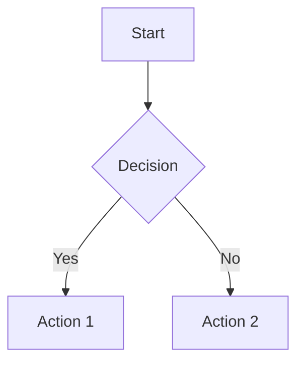
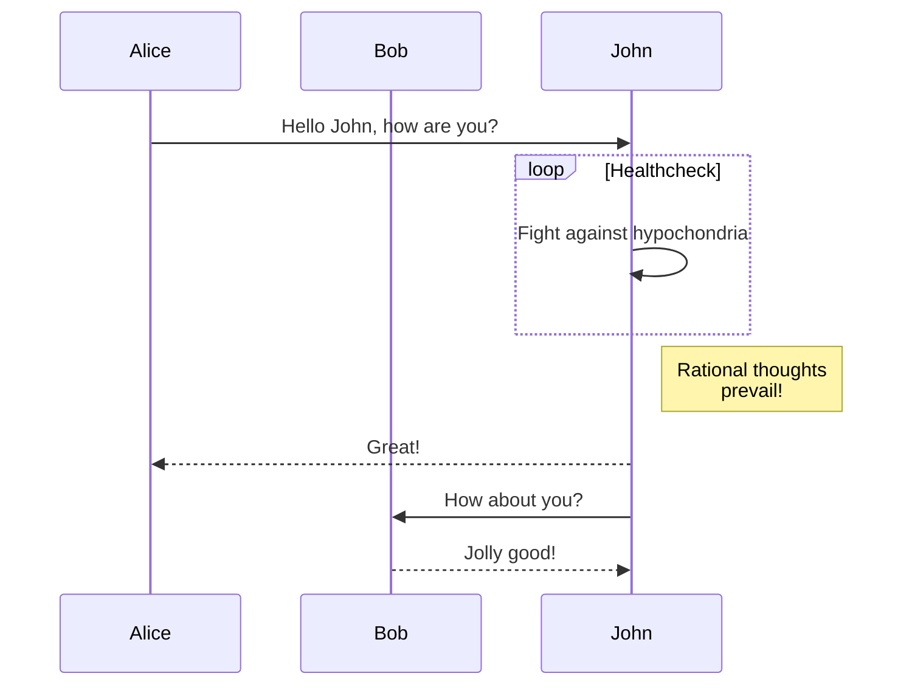

# AI Site Generator

A modern, frontend-only web app for step-by-step website creation, guided by an AI chat interface. Users authenticate with GitHub and deploy both the app and their generated sites via GitHub Pages. Live preview is available throughout the site-building process.

<<<<<<< HEAD
## 🚀 Tech Stack

- Frontend: React 19 + TypeScript
- Build: Vite 7
- Quality: ESLint + Prettier + Husky + Vitest
- Architecture: Clean Architecture (SOLID)

## 📁 Project Structure

The project follows SOLID and CLEAN architecture principles:

```
src/
├── components/     # UI components
├── hooks/          # Custom React hooks
├── services/       # External integrations and business logic
├── types/          # Type definitions
├── utils/          # Pure utility functions
├── assets/         # Static assets
└── styles/         # Global styles
```

### Architecture Principles

- SOLID: Single Responsibility, Open/Closed, Liskov Substitution, Interface Segregation, Dependency Inversion
- CLEAN: Separation of concerns with clear boundaries between layers
- DRY: Reuse utilities and hooks; avoid duplication
- KISS: Keep it simple and maintainable

## 🛠️ Development Setup

### Prerequisites

- Node.js 18+
- npm
- Git

### Installation

1. **Clone the repository**

   ```bash
   git clone https://github.com/juanmanueldaza/aisitegenerator.git
   cd aisitegenerator
   ```

2. **Install dependencies**

   ```bash
   npm install
   ```

3. **Start development server**

   ```bash
   npm run dev
   ```

4. **Open your browser**: go to `http://localhost:5173`

## 📜 Available Scripts

- `npm run dev` - Start development server with hot reload
- `npm run build` - Build for production
- `npm run preview` - Preview production build locally
- `npm run lint` - Run ESLint to check code quality
- `npm run lint:fix` - Fix auto-fixable ESLint issues
- `npm run format` - Format code with Prettier
- `npm run format:check` - Check if code is properly formatted
- `npm run typecheck` - TypeScript type checking
- `npm run test` - Run tests with Vitest
- `npm run test:watch` - Run tests in watch mode

## 🔧 Code Quality & Development Tools

### ESLint Configuration

- TypeScript-aware linting
- React hooks rules
- React refresh plugin for development

### Prettier Configuration

- Consistent code formatting
- 100 character line length
- Single quotes, semicolons

### Husky Pre-commit Hooks

- Automatic code linting and formatting before commits
- Ensures code quality consistency across the team

### TypeScript Configuration

- Strict mode enabled for maximum type safety
- Path aliases for clean imports:
   - `@types` → `src/types`
   - `@components` → `src/components`
   - `@hooks` → `src/hooks`
   - `@services` → `src/services`
   - `@utils` → `src/utils`
   - `@assets` → `src/assets`
   - `@styles` → `src/styles`

## 🏗️ Architecture Overview

### Service Layer (Dependency Inversion)

The `services/` directory contains abstract interfaces that define contracts for external integrations:

- `IAuthService` - GitHub authentication
- `IGitHubService` - Repository management and Pages deployment
- `ISiteService` - Site configuration management
- `IAIService` - AI chat and content generation

### Component Layer (Single Responsibility)

React components focus on a single responsibility:

- Presentation logic only
- Props-driven behavior
- Reusable and testable

### Hooks Layer (DRY Principle)

Custom hooks encapsulate reusable stateful logic:

- `useAuth` - Authentication state management
- `useSites` - Site configuration management
- `useDebouncedValue` - Debounced input handling
- `useLocalStorage` - Local storage state synchronization

### Utilities (Open/Closed Principle)

Pure functions that are open for extension but closed for modification:

- Date formatting
- Validation helpers
- Object manipulation utilities

## 🚦 Development Guidelines

### Code Style

- Use TypeScript strictly with proper type definitions
- Follow the established folder structure
- Implement proper error handling
- Write self-documenting code with clear naming

### Import Organization

```typescript
// External libraries
import React from 'react';

// Internal imports using path aliases
import { SomeComponent } from '@components/SomeComponent';
import { useAuth } from '@hooks';
import { formatDate } from '@utils';
import type { User } from '@types';
```

### Component Structure

```typescript
// Component props interface
interface ComponentProps {
  // prop definitions
}

// Component implementation
export const Component: React.FC<ComponentProps> = ({ prop }) => {
  // hooks
  // event handlers
  // render logic
};
```

## 🤝 Contributing

1. Fork the repository
2. Create a feature branch: `git checkout -b feature/amazing-feature`
3. Make your changes following the development guidelines
4. Run quality checks: `npm run lint && npm run format:check && npm run build`
5. Commit your changes: `git commit -m 'Add amazing feature'`
6. Push to the branch: `git push origin feature/amazing-feature`
7. Open a Pull Request

## 📄 License

This project is licensed under the MIT License — see the [LICENSE](./LICENSE) file for details.

## 🎯 Roadmap

<<<<<<< HEAD
- [ ] GitHub OAuth integration
- [ ] AI chat interface implementation
- [ ] Site template system
- [ ] Real-time preview functionality
- [ ] GitHub Pages deployment automation
- [ ] Site management dashboard

---

Built with ❤️ using modern web technologies and clean architecture principles.
=======
- [Live Demo](https://juanmanueldaza.github.io/aisitegenerator) *(Coming Soon)*
- [Issue Tracker](https://github.com/juanmanueldaza/aisitegenerator/issues)
- [Discussions](https://github.com/juanmanueldaza/aisitegenerator/discussions)
>>>>>>> 0a91720 (fix: correct markdown formatting and code block structure)
=======
## ✨ Features

### Core Functionality
- **Real-time Markdown Preview** - See your content rendered as you type
- **Mermaid Diagram Support** - Create flowcharts, sequence diagrams, and more
- **Error Handling** - Comprehensive error messages and graceful fallbacks
- **Responsive Design** - Works on desktop, tablet, and mobile devices
- **GitHub Pages Ready** - Static deployment with no backend required

### Supported Diagram Types
- Flowcharts and decision trees
- Sequence diagrams
- Class diagrams
- State diagrams
- User journey diagrams
- Gantt charts
- Pie charts
- Entity relationship diagrams

## 🚀 Getting Started

### Quick Start
1. Clone the repository
2. Open `index.html` in your browser or serve with a local server
3. Start creating content with live preview!

### Local Development
```bash
# Serve with Python (recommended)
python -m http.server 8000
# or
python3 -m http.server 8000

# Then open http://localhost:8000
```

### GitHub Pages Deployment
1. Push code to your GitHub repository
2. Enable GitHub Pages in repository settings
3. Your site will be available at `https://yourusername.github.io/aisitegenerator/`

## 📖 Usage

### Basic Markdown
Write standard markdown in the left panel and see it rendered in real-time on the right.

### Creating Diagrams
Use Mermaid syntax in code blocks:

````markdown

````

### Supported Diagram Examples

#### Flowchart
````markdown

````

#### Sequence Diagram
````markdown

````

## 🏗️ Architecture

### File Structure
```
├── index.html                 # Main application entry point
├── src/
│   ├── js/
│   │   ├── app.js             # Main application logic
│   │   ├── markdown-renderer.js   # Markdown processing
│   │   └── mermaid-integration.js # Mermaid diagram handling
│   └── styles/
│       └── main.css           # Application styles
└── package.json               # Project configuration
```

### Key Components

1. **MarkdownRenderer** - Handles markdown to HTML conversion with Mermaid support
2. **MermaidIntegration** - Manages Mermaid library loading, caching, and error handling
3. **AISiteGenerator** - Main application class that coordinates everything

### Performance Features
- **Lazy Loading** - Mermaid library loaded only when needed
- **Debounced Updates** - Real-time preview without excessive re-rendering
- **Diagram Caching** - Rendered diagrams cached to improve performance
- **Memory Management** - Automatic cleanup of removed diagrams

## 🛠️ Technical Details

### Dependencies
- **Mermaid** (v10.6.1) - Loaded from CDN for diagram rendering
- **Vanilla JavaScript** - No framework dependencies for maximum compatibility

### Browser Support
- Modern browsers with ES6+ support
- Chrome 60+, Firefox 55+, Safari 11+, Edge 79+

### Security
- XSS protection through content sanitization
- Safe HTML rendering
- Secure Mermaid configuration
- Content Security Policy ready

## 🚧 Development Status

This application implements the core requirements for issue #34 (Mermaid integration) and provides the foundation for issue #33 (markdown rendering).

### Completed Features
- ✅ Real-time markdown rendering
- ✅ Mermaid diagram support with all major diagram types
- ✅ Error handling and user feedback
- ✅ Responsive design
- ✅ Performance optimizations
- ✅ GitHub Pages compatibility

### Future Enhancements
- AI chat interface integration
- GitHub authentication
- Website generation wizard
- Template system
- Export functionality

## 📄 License

MIT License - see LICENSE file for details

## 🤝 Contributing

Contributions are welcome! Please feel free to submit a Pull Request.
>>>>>>> 9e018a2 (Implement complete Mermaid diagram integration with markdown rendering)
